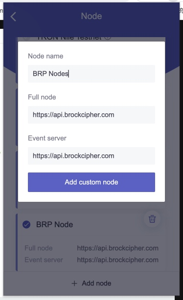
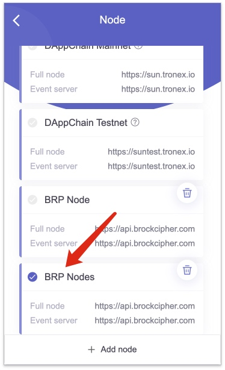
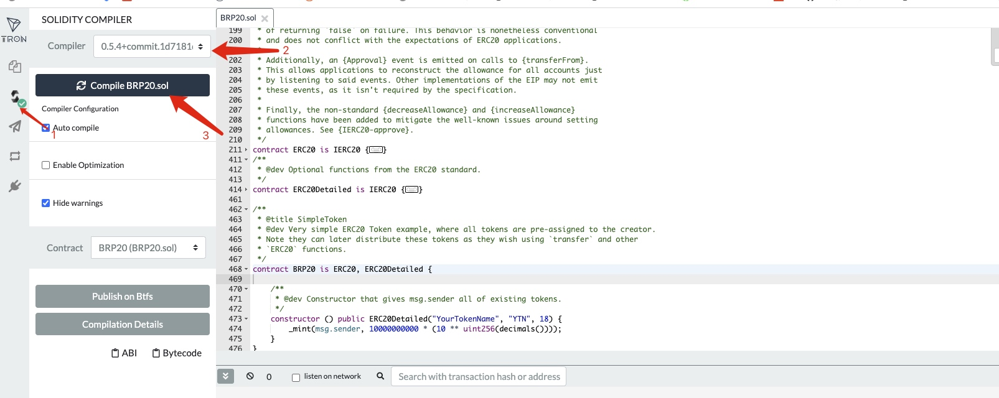
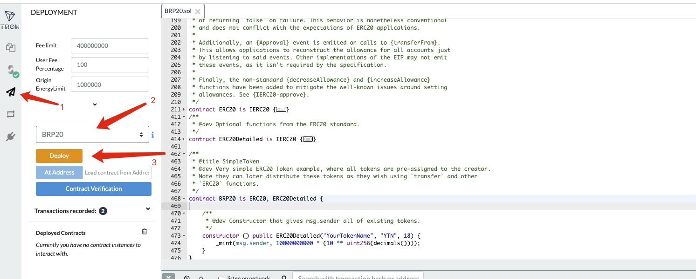
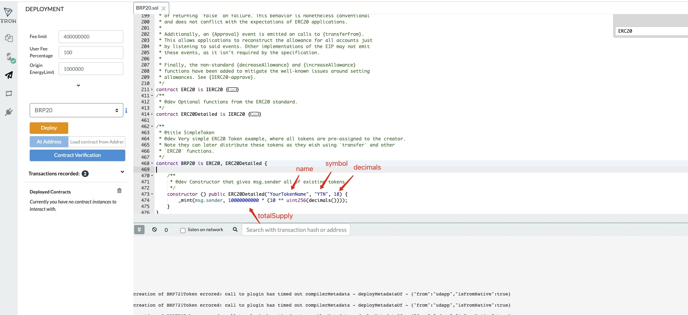
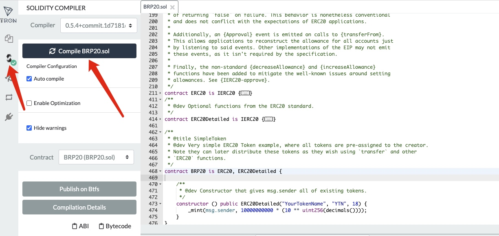
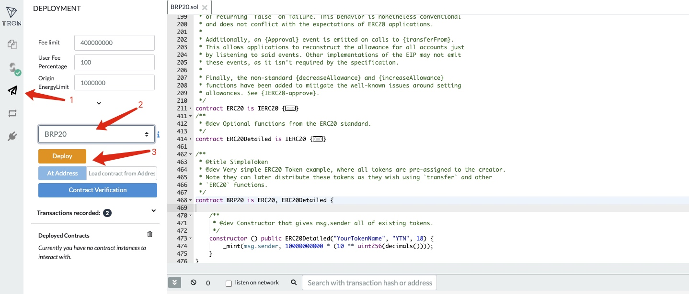
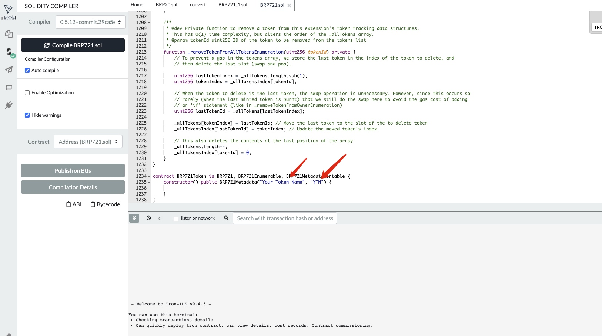
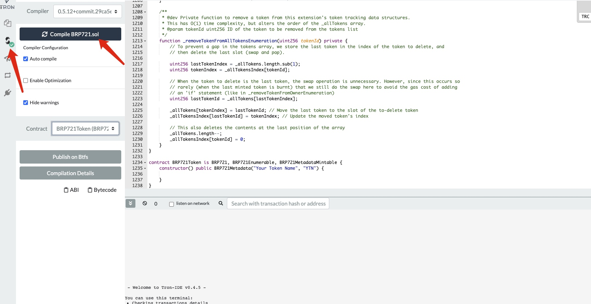
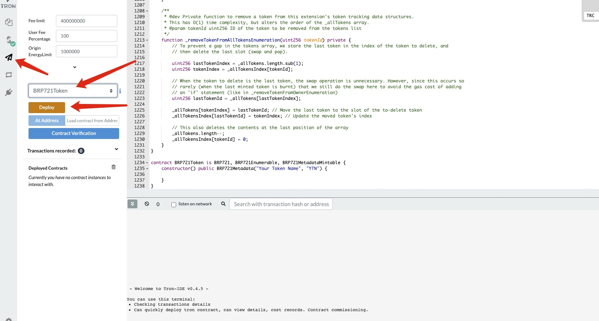

# BRP Documentation

## Tool
* TronLink Chrome
* [Tronide](http://www.tronide.io/)
* [BRP Wallet](https://www.brockcipher.com/)

## Develop

### BRP Mainnet

### BRP Mainnet https://api.brockcipher.com/

### Deploy smart contracts
1. Install TronLink Chrome Plugin
2. Prepare an address issue
    * You can Request Address and Import Wallet;
    * Set Up -> Node-> Add node -> Input https://api.brockcipher.com -> Select the node you just added
    
    


3. Open TRON IDE http://www.tronide.io;
4. Prepare a smart contract
5. Compile the smart contract
    * 1.Select the compile smart contract option
    * 2.Select Compile version number
    * 3.Click Compile
    

6. Deploy smart contracts
    * 1.Choose to deploy
    * 2.Select the corresponding smart contract
    * 3.Click Deploy
    


    
### Deploy BRP20 Tokens

#### Issuance of BRP20 tokens
1. Prepare [BRP20](https://github.com/brockcipher/Contract/blob/main/BRP20.sol) contract code
2. Modify "name", "symbol", "decimals" and "totalSupply" according to your requirements.
    

3. Compile the BRP20 contract
    

4. Deploy the BRP20 contract to the BRP node
    

5. BRP20 contract example
``` 
// 0.5.1-c8a2
// Enable optimization
pragma solidity ^0.5.0;

/**
 * @dev Wrappers over Solidity's arithmetic operations with added overflow
 * checks.
 *
 * Arithmetic operations in Solidity wrap on overflow. This can easily result
 * in bugs, because programmers usually assume that an overflow raises an
 * error, which is the standard behavior in high level programming languages.
 * `SafeMath` restores this intuition by reverting the transaction when an
 * operation overflows.
 *
 * Using this library instead of the unchecked operations eliminates an entire
 * class of bugs, so it's recommended to use it always.
 */
library SafeMath {
    /**
     * @dev Returns the addition of two unsigned integers, reverting on
     * overflow.
     *
     * Counterpart to Solidity's `+` operator.
     *
     * Requirements:
     * - Addition cannot overflow.
     */
    function add(uint256 a, uint256 b) internal pure returns (uint256) {
        uint256 c = a + b;
        require(c >= a, "SafeMath: addition overflow");

        return c;
    }

    /**
     * @dev Returns the subtraction of two unsigned integers, reverting on
     * overflow (when the result is negative).
     *
     * Counterpart to Solidity's `-` operator.
     *
     * Requirements:
     * - Subtraction cannot overflow.
     */
    function sub(uint256 a, uint256 b) internal pure returns (uint256) {
        require(b <= a, "SafeMath: subtraction overflow");
        uint256 c = a - b;

        return c;
    }

    /**
     * @dev Returns the multiplication of two unsigned integers, reverting on
     * overflow.
     *
     * Counterpart to Solidity's `*` operator.
     *
     * Requirements:
     * - Multiplication cannot overflow.
     */
    function mul(uint256 a, uint256 b) internal pure returns (uint256) {
        // Gas optimization: this is cheaper than requiring 'a' not being zero, but the
        // benefit is lost if 'b' is also tested.
        // See: https://github.com/OpenZeppelin/openzeppelin-contracts/pull/522
        if (a == 0) {
            return 0;
        }

        uint256 c = a * b;
        require(c / a == b, "SafeMath: multiplication overflow");

        return c;
    }

    /**
     * @dev Returns the integer division of two unsigned integers. Reverts on
     * division by zero. The result is rounded towards zero.
     *
     * Counterpart to Solidity's `/` operator. Note: this function uses a
     * `revert` opcode (which leaves remaining gas untouched) while Solidity
     * uses an invalid opcode to revert (consuming all remaining gas).
     *
     * Requirements:
     * - The divisor cannot be zero.
     */
    function div(uint256 a, uint256 b) internal pure returns (uint256) {
        // Solidity only automatically asserts when dividing by 0
        require(b > 0, "SafeMath: division by zero");
        uint256 c = a / b;
        // assert(a == b * c + a % b); // There is no case in which this doesn't hold

        return c;
    }

    /**
     * @dev Returns the remainder of dividing two unsigned integers. (unsigned integer modulo),
     * Reverts when dividing by zero.
     *
     * Counterpart to Solidity's `%` operator. This function uses a `revert`
     * opcode (which leaves remaining gas untouched) while Solidity uses an
     * invalid opcode to revert (consuming all remaining gas).
     *
     * Requirements:
     * - The divisor cannot be zero.
     */
    function mod(uint256 a, uint256 b) internal pure returns (uint256) {
        require(b != 0, "SafeMath: modulo by zero");
        return a % b;
    }
}

/**
 * @dev Interface of the ERC20 standard as defined in the EIP. Does not include
 * the optional functions; to access them see {ERC20Detailed}.
 */
interface IERC20 {
    /**
     * @dev Returns the amount of tokens in existence.
     */
    function totalSupply() external view returns (uint256);

    /**
     * @dev Returns the amount of tokens owned by `account`.
     */
    function balanceOf(address account) external view returns (uint256);

    /**
     * @dev Moves `amount` tokens from the caller's account to `recipient`.
     *
     * Returns a boolean value indicating whether the operation succeeded.
     *
     * Emits a {Transfer} event.
     */
    function transfer(address recipient, uint256 amount) external returns (bool);

    /**
     * @dev Returns the remaining number of tokens that `spender` will be
     * allowed to spend on behalf of `owner` through {transferFrom}. This is
     * zero by default.
     *
     * This value changes when {approve} or {transferFrom} are called.
     */
    function allowance(address owner, address spender) external view returns (uint256);

    /**
     * @dev Sets `amount` as the allowance of `spender` over the caller's tokens.
     *
     * Returns a boolean value indicating whether the operation succeeded.
     *
     * IMPORTANT: Beware that changing an allowance with this method brings the risk
     * that someone may use both the old and the new allowance by unfortunate
     * transaction ordering. One possible solution to mitigate this race
     * condition is to first reduce the spender's allowance to 0 and set the
     * desired value afterwards:
     * https://github.com/ethereum/EIPs/issues/20#issuecomment-263524729
     *
     * Emits an {Approval} event.
     */
    function approve(address spender, uint256 amount) external returns (bool);

    /**
     * @dev Moves `amount` tokens from `sender` to `recipient` using the
     * allowance mechanism. `amount` is then deducted from the caller's
     * allowance.
     *
     * Returns a boolean value indicating whether the operation succeeded.
     *
     * Emits a {Transfer} event.
     */
    function transferFrom(address sender, address recipient, uint256 amount) external returns (bool);

    /**
     * @dev Emitted when `value` tokens are moved from one account (`from`) to
     * another (`to`).
     *
     * Note that `value` may be zero.
     */
    event Transfer(address indexed from, address indexed to, uint256 value);

    /**
     * @dev Emitted when the allowance of a `spender` for an `owner` is set by
     * a call to {approve}. `value` is the new allowance.
     */
    event Approval(address indexed owner, address indexed spender, uint256 value);
}


/**
 * @dev Implementation of the {IERC20} interface.
 *
 * This implementation is agnostic to the way tokens are created. This means
 * that a supply mechanism has to be added in a derived contract using {_mint}.
 * For a generic mechanism see {ERC20Mintable}.
 *
 * TIP: For a detailed writeup see our guide
 * https://forum.zeppelin.solutions/t/how-to-implement-erc20-supply-mechanisms/226[How
 * to implement supply mechanisms].
 *
 * We have followed general OpenZeppelin guidelines: functions revert instead
 * of returning `false` on failure. This behavior is nonetheless conventional
 * and does not conflict with the expectations of ERC20 applications.
 *
 * Additionally, an {Approval} event is emitted on calls to {transferFrom}.
 * This allows applications to reconstruct the allowance for all accounts just
 * by listening to said events. Other implementations of the EIP may not emit
 * these events, as it isn't required by the specification.
 *
 * Finally, the non-standard {decreaseAllowance} and {increaseAllowance}
 * functions have been added to mitigate the well-known issues around setting
 * allowances. See {IERC20-approve}.
 */
contract ERC20 is IERC20 {
    using SafeMath for uint256;

    mapping (address => uint256) private _balances;

    mapping (address => mapping (address => uint256)) private _allowances;

    uint256 private _totalSupply;

    /**
     * @dev See {IERC20-totalSupply}.
     */
    function totalSupply() public view returns (uint256) {
        return _totalSupply;
    }

    /**
     * @dev See {IERC20-balanceOf}.
     */
    function balanceOf(address account) public view returns (uint256) {
        return _balances[account];
    }

    /**
     * @dev See {IERC20-transfer}.
     *
     * Requirements:
     *
     * - `recipient` cannot be the zero address.
     * - the caller must have a balance of at least `amount`.
     */
    function transfer(address recipient, uint256 amount) public returns (bool) {
        _transfer(msg.sender, recipient, amount);
        return true;
    }

    /**
     * @dev See {IERC20-allowance}.
     */
    function allowance(address owner, address spender) public view returns (uint256) {
        return _allowances[owner][spender];
    }

    /**
     * @dev See {IERC20-approve}.
     *
     * Requirements:
     *
     * - `spender` cannot be the zero address.
     */
    function approve(address spender, uint256 value) public returns (bool) {
        _approve(msg.sender, spender, value);
        return true;
    }

    /**
     * @dev See {IERC20-transferFrom}.
     *
     * Emits an {Approval} event indicating the updated allowance. This is not
     * required by the EIP. See the note at the beginning of {ERC20};
     *
     * Requirements:
     * - `sender` and `recipient` cannot be the zero address.
     * - `sender` must have a balance of at least `value`.
     * - the caller must have allowance for `sender`'s tokens of at least
     * `amount`.
     */
    function transferFrom(address sender, address recipient, uint256 amount) public returns (bool) {
        _transfer(sender, recipient, amount);
        _approve(sender, msg.sender, _allowances[sender][msg.sender].sub(amount));
        return true;
    }

    /**
     * @dev Atomically increases the allowance granted to `spender` by the caller.
     *
     * This is an alternative to {approve} that can be used as a mitigation for
     * problems described in {IERC20-approve}.
     *
     * Emits an {Approval} event indicating the updated allowance.
     *
     * Requirements:
     *
     * - `spender` cannot be the zero address.
     */
    function increaseAllowance(address spender, uint256 addedValue) public returns (bool) {
        _approve(msg.sender, spender, _allowances[msg.sender][spender].add(addedValue));
        return true;
    }

    /**
     * @dev Atomically decreases the allowance granted to `spender` by the caller.
     *
     * This is an alternative to {approve} that can be used as a mitigation for
     * problems described in {IERC20-approve}.
     *
     * Emits an {Approval} event indicating the updated allowance.
     *
     * Requirements:
     *
     * - `spender` cannot be the zero address.
     * - `spender` must have allowance for the caller of at least
     * `subtractedValue`.
     */
    function decreaseAllowance(address spender, uint256 subtractedValue) public returns (bool) {
        _approve(msg.sender, spender, _allowances[msg.sender][spender].sub(subtractedValue));
        return true;
    }

    /**
     * @dev Moves tokens `amount` from `sender` to `recipient`.
     *
     * This is internal function is equivalent to {transfer}, and can be used to
     * e.g. implement automatic token fees, slashing mechanisms, etc.
     *
     * Emits a {Transfer} event.
     *
     * Requirements:
     *
     * - `sender` cannot be the zero address.
     * - `recipient` cannot be the zero address.
     * - `sender` must have a balance of at least `amount`.
     */
    function _transfer(address sender, address recipient, uint256 amount) internal {
        require(sender != address(0), "ERC20: transfer from the zero address");
        require(recipient != address(0), "ERC20: transfer to the zero address");

        _balances[sender] = _balances[sender].sub(amount);
        _balances[recipient] = _balances[recipient].add(amount);
        emit Transfer(sender, recipient, amount);
    }

    /** @dev Creates `amount` tokens and assigns them to `account`, increasing
     * the total supply.
     *
     * Emits a {Transfer} event with `from` set to the zero address.
     *
     * Requirements
     *
     * - `to` cannot be the zero address.
     */
    function _mint(address account, uint256 amount) internal {
        require(account != address(0), "ERC20: mint to the zero address");

        _totalSupply = _totalSupply.add(amount);
        _balances[account] = _balances[account].add(amount);
        emit Transfer(address(0), account, amount);
    }

     /**
     * @dev Destroys `amount` tokens from `account`, reducing the
     * total supply.
     *
     * Emits a {Transfer} event with `to` set to the zero address.
     *
     * Requirements
     *
     * - `account` cannot be the zero address.
     * - `account` must have at least `amount` tokens.
     */
    function _burn(address account, uint256 value) internal {
        require(account != address(0), "ERC20: burn from the zero address");

        _totalSupply = _totalSupply.sub(value);
        _balances[account] = _balances[account].sub(value);
        emit Transfer(account, address(0), value);
    }

    /**
     * @dev Sets `amount` as the allowance of `spender` over the `owner`s tokens.
     *
     * This is internal function is equivalent to `approve`, and can be used to
     * e.g. set automatic allowances for certain subsystems, etc.
     *
     * Emits an {Approval} event.
     *
     * Requirements:
     *
     * - `owner` cannot be the zero address.
     * - `spender` cannot be the zero address.
     */
    function _approve(address owner, address spender, uint256 value) internal {
        require(owner != address(0), "ERC20: approve from the zero address");
        require(spender != address(0), "ERC20: approve to the zero address");

        _allowances[owner][spender] = value;
        emit Approval(owner, spender, value);
    }

    /**
     * @dev Destoys `amount` tokens from `account`.`amount` is then deducted
     * from the caller's allowance.
     *
     * See {_burn} and {_approve}.
     */
    function _burnFrom(address account, uint256 amount) internal {
        _burn(account, amount);
        _approve(account, msg.sender, _allowances[account][msg.sender].sub(amount));
    }
}
/**
 * @dev Optional functions from the ERC20 standard.
 */
contract ERC20Detailed is IERC20 {
    string private _name;
    string private _symbol;
    uint8 private _decimals;

    /**
     * @dev Sets the values for `name`, `symbol`, and `decimals`. All three of
     * these values are immutable: they can only be set once during
     * construction.
     */
    constructor (string memory name, string memory symbol, uint8 decimals) public {
        _name = name;
        _symbol = symbol;
        _decimals = decimals;
    }

    /**
     * @dev Returns the name of the token.
     */
    function name() public view returns (string memory) {
        return _name;
    }

    /**
     * @dev Returns the symbol of the token, usually a shorter version of the
     * name.
     */
    function symbol() public view returns (string memory) {
        return _symbol;
    }

    /**
     * @dev Returns the number of decimals used to get its user representation.
     * For example, if `decimals` equals `2`, a balance of `505` tokens should
     * be displayed to a user as `5,05` (`505 / 10 ** 2`).
     *
     * Tokens usually opt for a value of 18, imitating the relationship between
     * Ether and Wei.
     *
     * NOTE: This information is only used for _display_ purposes: it in
     * no way affects any of the arithmetic of the contract, including
     * {IERC20-balanceOf} and {IERC20-transfer}.
     */
    function decimals() public view returns (uint8) {
        return _decimals;
    }
}

/**
 * @title SimpleToken
 * @dev Very simple ERC20 Token example, where all tokens are pre-assigned to the creator.
 * Note they can later distribute these tokens as they wish using `transfer` and other
 * `ERC20` functions.
 */
contract BRP20 is ERC20, ERC20Detailed {

    /**
     * @dev Constructor that gives msg.sender all of existing tokens.
     */
    constructor () public ERC20Detailed("YourTokenName", "YTN", 18) {
        _mint(msg.sender, 10000000000 * (10 ** uint256(decimals())));
    }
}
```

### BRP721 Contract
1. Prepare [BRP721](https://github.com/brockcipher/Contract/blob/main/BRP721.sol) contract code
2. Modify "name", "symbol" according to your requirements.
    


3. Compile the BRP721 contract
    

4. Deploy the BRP721 contract to the BRP node
    

    
5. BRP721 Contract Example
```
pragma solidity ^0.5.0;

/**
 * @dev Wrappers over Solidity's arithmetic operations with added overflow
 * checks.
 *
 * Arithmetic operations in Solidity wrap on overflow. This can easily result
 * in bugs, because programmers usually assume that an overflow raises an
 * error, which is the standard behavior in high level programming languages.
 * `SafeMath` restores this intuition by reverting the transaction when an
 * operation overflows.
 *
 * Using this library instead of the unchecked operations eliminates an entire
 * class of bugs, so it's recommended to use it always.
 */
library SafeMath {
    /**
     * @dev Returns the addition of two unsigned integers, reverting on
     * overflow.
     *
     * Counterpart to Solidity's `+` operator.
     *
     * Requirements:
     * - Addition cannot overflow.
     */
    function add(uint256 a, uint256 b) internal pure returns (uint256) {
        uint256 c = a + b;
        require(c >= a, "SafeMath: addition overflow");

        return c;
    }

    /**
     * @dev Returns the subtraction of two unsigned integers, reverting on
     * overflow (when the result is negative).
     *
     * Counterpart to Solidity's `-` operator.
     *
     * Requirements:
     * - Subtraction cannot overflow.
     */
    function sub(uint256 a, uint256 b) internal pure returns (uint256) {
        return sub(a, b, "SafeMath: subtraction overflow");
    }

    /**
     * @dev Returns the subtraction of two unsigned integers, reverting with custom message on
     * overflow (when the result is negative).
     *
     * Counterpart to Solidity's `-` operator.
     *
     * Requirements:
     * - Subtraction cannot overflow.
     *
     * _Available since v2.4.0._
     */
    function sub(uint256 a, uint256 b, string memory errorMessage) internal pure returns (uint256) {
        require(b <= a, errorMessage);
        uint256 c = a - b;

        return c;
    }

    /**
     * @dev Returns the multiplication of two unsigned integers, reverting on
     * overflow.
     *
     * Counterpart to Solidity's `*` operator.
     *
     * Requirements:
     * - Multiplication cannot overflow.
     */
    function mul(uint256 a, uint256 b) internal pure returns (uint256) {
        // Gas optimization: this is cheaper than requiring 'a' not being zero, but the
        // benefit is lost if 'b' is also tested.
        // See: https://github.com/OpenZeppelin/openzeppelin-contracts/pull/522
        if (a == 0) {
            return 0;
        }

        uint256 c = a * b;
        require(c / a == b, "SafeMath: multiplication overflow");

        return c;
    }

    /**
     * @dev Returns the integer division of two unsigned integers. Reverts on
     * division by zero. The result is rounded towards zero.
     *
     * Counterpart to Solidity's `/` operator. Note: this function uses a
     * `revert` opcode (which leaves remaining gas untouched) while Solidity
     * uses an invalid opcode to revert (consuming all remaining gas).
     *
     * Requirements:
     * - The divisor cannot be zero.
     */
    function div(uint256 a, uint256 b) internal pure returns (uint256) {
        return div(a, b, "SafeMath: division by zero");
    }

    /**
     * @dev Returns the integer division of two unsigned integers. Reverts with custom message on
     * division by zero. The result is rounded towards zero.
     *
     * Counterpart to Solidity's `/` operator. Note: this function uses a
     * `revert` opcode (which leaves remaining gas untouched) while Solidity
     * uses an invalid opcode to revert (consuming all remaining gas).
     *
     * Requirements:
     * - The divisor cannot be zero.
     *
     * _Available since v2.4.0._
     */
    function div(uint256 a, uint256 b, string memory errorMessage) internal pure returns (uint256) {
        // Solidity only automatically asserts when dividing by 0
        require(b > 0, errorMessage);
        uint256 c = a / b;
        // assert(a == b * c + a % b); // There is no case in which this doesn't hold

        return c;
    }

    /**
     * @dev Returns the remainder of dividing two unsigned integers. (unsigned integer modulo),
     * Reverts when dividing by zero.
     *
     * Counterpart to Solidity's `%` operator. This function uses a `revert`
     * opcode (which leaves remaining gas untouched) while Solidity uses an
     * invalid opcode to revert (consuming all remaining gas).
     *
     * Requirements:
     * - The divisor cannot be zero.
     */
    function mod(uint256 a, uint256 b) internal pure returns (uint256) {
        return mod(a, b, "SafeMath: modulo by zero");
    }

    /**
     * @dev Returns the remainder of dividing two unsigned integers. (unsigned integer modulo),
     * Reverts with custom message when dividing by zero.
     *
     * Counterpart to Solidity's `%` operator. This function uses a `revert`
     * opcode (which leaves remaining gas untouched) while Solidity uses an
     * invalid opcode to revert (consuming all remaining gas).
     *
     * Requirements:
     * - The divisor cannot be zero.
     *
     * _Available since v2.4.0._
     */
    function mod(uint256 a, uint256 b, string memory errorMessage) internal pure returns (uint256) {
        require(b != 0, errorMessage);
        return a % b;
    }
}

/*
 * @dev Provides information about the current execution context, including the
 * sender of the transaction and its data. While these are generally available
 * via msg.sender and msg.data, they should not be accessed in such a direct
 * manner, since when dealing with GSN meta-transactions the account sending and
 * paying for execution may not be the actual sender (as far as an application
 * is concerned).
 *
 * This contract is only required for intermediate, library-like contracts.
 */
contract Context {
    // Empty internal constructor, to prevent people from mistakenly deploying
    // an instance of this contract, which should be used via inheritance.
    constructor () internal { }
    // solhint-disable-previous-line no-empty-blocks

    function _msgSender() internal view returns (address payable) {
        return msg.sender;
    }

    function _msgData() internal view returns (bytes memory) {
        this; // silence state mutability warning without generating bytecode - see https://github.com/ethereum/solidity/issues/2691
        return msg.data;
    }
}

/**
 * @title Roles
 * @dev Library for managing addresses assigned to a Role.
 */
library Roles {
    struct Role {
        mapping (address => bool) bearer;
    }

    /**
     * @dev Give an account access to this role.
     */
    function add(Role storage role, address account) internal {
        require(!has(role, account), "Roles: account already has role");
        role.bearer[account] = true;
    }

    /**
     * @dev Remove an account's access to this role.
     */
    function remove(Role storage role, address account) internal {
        require(has(role, account), "Roles: account does not have role");
        role.bearer[account] = false;
    }

    /**
     * @dev Check if an account has this role.
     * @return bool
     */
    function has(Role storage role, address account) internal view returns (bool) {
        require(account != address(0), "Roles: account is the zero address");
        return role.bearer[account];
    }
}
pragma solidity ^0.5.5;

/**
 * @dev Collection of functions related to the address type
 */
library Address {
    /**
     * @dev Converts an `address` into `address payable`. Note that this is
     * simply a type cast: the actual underlying value is not changed.
     *
     * _Available since v2.4.0._
     */
    function toPayable(address account) internal pure returns (address payable) {
        return address(uint160(account));
    }

    /**
     * @dev Replacement for Solidity's `transfer`: sends `amount` wei to
     * `recipient`, forwarding all available gas and reverting on errors.
     *
     * https://diligence.consensys.net/posts/2019/09/stop-using-soliditys-transfer-now/[Learn more].
     *
     * IMPORTANT: because control is transferred to `recipient`, care must be
     * taken to not create reentrancy vulnerabilities. Consider using
     * {ReentrancyGuard} or the
     * https://solidity.readthedocs.io/en/v0.5.11/security-considerations.html#use-the-checks-effects-interactions-pattern[checks-effects-interactions pattern].
     *
     * _Available since v2.4.0._
     */
    function sendValue(address payable recipient, uint256 amount) internal {
        require(address(this).balance >= amount, "Address: insufficient balance");

        // solhint-disable-next-line avoid-call-value
        (bool success, ) = recipient.call.value(amount)("");
        require(success, "Address: unable to send value, recipient may have reverted");
    }
}


/**
 * @title Counters
 * @author Matt Condon (@shrugs)
 * @dev Provides counters that can only be incremented or decremented by one. This can be used e.g. to track the number
 * of elements in a mapping, issuing BRP721 ids, or counting request ids.
 *
 * Include with `using Counters for Counters.Counter;`
 * Since it is not possible to overflow a 256 bit integer with increments of one, `increment` can skip the {SafeMath}
 * overflow check, thereby saving gas. This does assume however correct usage, in that the underlying `_value` is never
 * directly accessed.
 */
library Counters {
    using SafeMath for uint256;

    struct Counter {
        // This variable should never be directly accessed by users of the library: interactions must be restricted to
        // the library's function. As of Solidity v0.5.2, this cannot be enforced, though there is a proposal to add
        // this feature: see https://github.com/ethereum/solidity/issues/4637
        uint256 _value; // default: 0
    }

    function current(Counter storage counter) internal view returns (uint256) {
        return counter._value;
    }

    function increment(Counter storage counter) internal {
        // The {SafeMath} overflow check can be skipped here, see the comment at the top
        counter._value += 1;
    }

    function decrement(Counter storage counter) internal {
        counter._value = counter._value.sub(1);
    }
}


contract MinterRole is Context {
    using Roles for Roles.Role;

    event MinterAdded(address indexed account);
    event MinterRemoved(address indexed account);

    Roles.Role private _minters;

    constructor () internal {
        _addMinter(_msgSender());
    }

    modifier onlyMinter() {
        require(isMinter(_msgSender()), "MinterRole: caller does not have the Minter role");
        _;
    }

    function isMinter(address account) public view returns (bool) {
        return _minters.has(account);
    }

    function addMinter(address account) public onlyMinter {
        _addMinter(account);
    }

    function renounceMinter() public {
        _removeMinter(_msgSender());
    }

    function _addMinter(address account) internal {
        _minters.add(account);
        emit MinterAdded(account);
    }

    function _removeMinter(address account) internal {
        _minters.remove(account);
        emit MinterRemoved(account);
    }
}

/**
 * @dev Interface of the BRP165 standard.
 *
 * Implementers can declare support of contract interfaces, which can then be
 * queried by others ({BRP165Checker}).
 *
 * For an implementation, see {BRP165}.
 */
interface IBRP165 {
    /**
     * @dev Returns true if this contract implements the interface defined by
     * `interfaceId`.
     *
     * This function call must use less than 30 000 gas.
     */
    function supportsInterface(bytes4 interfaceId) external view returns (bool);
}


/**
 * @dev Required interface of an BRP721 compliant contract.
 */
contract IBRP721 is IBRP165 {
    event Transfer(address indexed from, address indexed to, uint256 indexed tokenId);
    event Approval(address indexed owner, address indexed approved, uint256 indexed tokenId);
    event ApprovalForAll(address indexed owner, address indexed operator, bool approved);

    /**
     * @dev Returns the number of NFTs in `owner`'s account.
     */
    function balanceOf(address owner) public view returns (uint256 balance);

    /**
     * @dev Returns the owner of the NFT specified by `tokenId`.
     */
    function ownerOf(uint256 tokenId) public view returns (address owner);

    /**
     * @dev Transfers a specific NFT (`tokenId`) from one account (`from`) to
     * another (`to`).
     *
     *
     *
     * Requirements:
     * - `from`, `to` cannot be zero.
     * - `tokenId` must be owned by `from`.
     * - If the caller is not `from`, it must be have been allowed to move this
     * NFT by either {approve} or {setApprovalForAll}.
     */
    function safeTransferFrom(address from, address to, uint256 tokenId) public;
    /**
     * @dev Transfers a specific NFT (`tokenId`) from one account (`from`) to
     * another (`to`).
     *
     * Requirements:
     * - If the caller is not `from`, it must be approved to move this NFT by
     * either {approve} or {setApprovalForAll}.
     */
    function transferFrom(address from, address to, uint256 tokenId) public;
    function approve(address to, uint256 tokenId) public;
    function getApproved(uint256 tokenId) public view returns (address operator);

    function setApprovalForAll(address operator, bool _approved) public;
    function isApprovedForAll(address owner, address operator) public view returns (bool);


    function safeTransferFrom(address from, address to, uint256 tokenId, bytes memory data) public;
}


/**
 * @title BRP-721 Non-Fungible Token Standard, optional metadata extension
 */
contract IBRP721Metadata is IBRP721 {
    function name() external view returns (string memory);
    function symbol() external view returns (string memory);
    function tokenURI(uint256 tokenId) external view returns (string memory);
}

/**
 * @title BRP721 token receiver interface
 * @dev Interface for any contract that wants to support safeTransfers
 * from BRP721 asset contracts.
 */
contract IBRP721Receiver {
    /**
     * @notice Handle the receipt of an NFT
     * @dev The BRP721 smart contract calls this function on the recipient
     * after a {IBRP721-safeTransferFrom}. This function MUST return the function selector,
     * otherwise the caller will revert the transaction. The selector to be
     * returned can be obtained as `this.onBRP721Received.selector`. This
     * function MAY throw to revert and reject the transfer.
     * Note: the BRP721 contract address is always the message sender.
     * @param operator The address which called `safeTransferFrom` function
     * @param from The address which previously owned the token
     * @param tokenId The NFT identifier which is being transferred
     * @param data Additional data with no specified format
     * @return bytes4 `bytes4(keccak256("onBRP721Received(address,address,uint256,bytes)"))`
     */
    function onBRP721Received(address operator, address from, uint256 tokenId, bytes memory data)
    public returns (bytes4);
}


/**
 * @dev Implementation of the {IBRP165} interface.
 *
 * Contracts may inherit from this and call {_registerInterface} to declare
 * their support of an interface.
 */
contract BRP165 is IBRP165 {
    /*
     * bytes4(keccak256('supportsInterface(bytes4)')) == 0x01ffc9a7
     */
    bytes4 private constant _INTERFACE_ID_BRP165 = 0x01ffc9a7;

    /**
     * @dev Mapping of interface ids to whether or not it's supported.
     */
    mapping(bytes4 => bool) private _supportedInterfaces;

    constructor () internal {
        // Derived contracts need only register support for their own interfaces,
        // we register support for BRP165 itself here
        _registerInterface(_INTERFACE_ID_BRP165);
    }

    /**
     * @dev See {IBRP165-supportsInterface}.
     *
     * Time complexity O(1), guaranteed to always use less than 30 000 gas.
     */
    function supportsInterface(bytes4 interfaceId) external view returns (bool) {
        return _supportedInterfaces[interfaceId];
    }

    /**
     * @dev Registers the contract as an implementer of the interface defined by
     * `interfaceId`. Support of the actual BRP165 interface is automatic and
     * registering its interface id is not required.
     *
     * See {IBRP165-supportsInterface}.
     *
     * Requirements:
     *
     * - `interfaceId` cannot be the BRP165 invalid interface (`0xffffffff`).
     */
    function _registerInterface(bytes4 interfaceId) internal {
        require(interfaceId != 0xffffffff, "BRP165: invalid interface id");
        _supportedInterfaces[interfaceId] = true;
    }
}


/**
 * @title BRP721 Non-Fungible Token Standard basic implementation
 */
contract BRP721 is Context, BRP165, IBRP721 {
    using SafeMath for uint256;
    using Address for address;
    using Counters for Counters.Counter;

    // Equals to `bytes4(keccak256("onBRP721Received(address,address,uint256,bytes)"))`
    // which can be also obtained as `IBRP721Receiver(0).onBRP721Received.selector`
    //
    // NOTE: BRP721 uses 0x150b7a02, BRP721 uses 0x5175f878.
    bytes4 private constant _BRP721_RECEIVED = 0x5175f878;

    // Mapping from token ID to owner
    mapping (uint256 => address) private _tokenOwner;

    // Mapping from token ID to approved address
    mapping (uint256 => address) private _tokenApprovals;

    // Mapping from owner to number of owned token
    mapping (address => Counters.Counter) private _ownedTokensCount;

    // Mapping from owner to operator approvals
    mapping (address => mapping (address => bool)) private _operatorApprovals;

    /*
     *     bytes4(keccak256('balanceOf(address)')) == 0x70a08231
     *     bytes4(keccak256('ownerOf(uint256)')) == 0x6352211e
     *     bytes4(keccak256('approve(address,uint256)')) == 0x095ea7b3
     *     bytes4(keccak256('getApproved(uint256)')) == 0x081812fc
     *     bytes4(keccak256('setApprovalForAll(address,bool)')) == 0xa22cb465
     *     bytes4(keccak256('isApprovedForAll(address,address)')) == 0xe985e9c5
     *     bytes4(keccak256('transferFrom(address,address,uint256)')) == 0x23b872dd
     *     bytes4(keccak256('safeTransferFrom(address,address,uint256)')) == 0x42842e0e
     *     bytes4(keccak256('safeTransferFrom(address,address,uint256,bytes)')) == 0xb88d4fde
     *
     *     => 0x70a08231 ^ 0x6352211e ^ 0x095ea7b3 ^ 0x081812fc ^
     *        0xa22cb465 ^ 0xe985e9c ^ 0x23b872dd ^ 0x42842e0e ^ 0xb88d4fde == 0x80ac58cd
     */
    bytes4 private constant _INTERFACE_ID_BRP721 = 0x80ac58cd;

    constructor () public {
        // register the supported interfaces to conform to BRP721 via BRP165
        _registerInterface(_INTERFACE_ID_BRP721);
    }

    /**
     * @dev Gets the balance of the specified address.
     * @param owner address to query the balance of
     * @return uint256 representing the amount owned by the passed address
     */
    function balanceOf(address owner) public view returns (uint256) {
        require(owner != address(0), "BRP721: balance query for the zero address");

        return _ownedTokensCount[owner].current();
    }

    /**
     * @dev Gets the owner of the specified token ID.
     * @param tokenId uint256 ID of the token to query the owner of
     * @return address currently marked as the owner of the given token ID
     */
    function ownerOf(uint256 tokenId) public view returns (address) {
        address owner = _tokenOwner[tokenId];
        require(owner != address(0), "BRP721: owner query for nonexistent token");

        return owner;
    }

    /**
     * @dev Approves another address to transfer the given token ID
     * The zero address indicates there is no approved address.
     * There can only be one approved address per token at a given time.
     * Can only be called by the token owner or an approved operator.
     * @param to address to be approved for the given token ID
     * @param tokenId uint256 ID of the token to be approved
     */
    function approve(address to, uint256 tokenId) public {
        address owner = ownerOf(tokenId);
        require(to != owner, "BRP721: approval to current owner");

        require(_msgSender() == owner || isApprovedForAll(owner, _msgSender()),
            "BRP721: approve caller is not owner nor approved for all"
        );

        _tokenApprovals[tokenId] = to;
        emit Approval(owner, to, tokenId);
    }

    /**
     * @dev Gets the approved address for a token ID, or zero if no address set
     * Reverts if the token ID does not exist.
     * @param tokenId uint256 ID of the token to query the approval of
     * @return address currently approved for the given token ID
     */
    function getApproved(uint256 tokenId) public view returns (address) {
        require(_exists(tokenId), "BRP721: approved query for nonexistent token");

        return _tokenApprovals[tokenId];
    }

    /**
     * @dev Sets or unsets the approval of a given operator
     * An operator is allowed to transfer all tokens of the sender on their behalf.
     * @param to operator address to set the approval
     * @param approved representing the status of the approval to be set
     */
    function setApprovalForAll(address to, bool approved) public {
        require(to != _msgSender(), "BRP721: approve to caller");

        _operatorApprovals[_msgSender()][to] = approved;
        emit ApprovalForAll(_msgSender(), to, approved);
    }

    /**
     * @dev Tells whether an operator is approved by a given owner.
     * @param owner owner address which you want to query the approval of
     * @param operator operator address which you want to query the approval of
     * @return bool whether the given operator is approved by the given owner
     */
    function isApprovedForAll(address owner, address operator) public view returns (bool) {
        return _operatorApprovals[owner][operator];
    }

    /**
     * @dev Transfers the ownership of a given token ID to another address.
     * Usage of this method is discouraged, use {safeTransferFrom} whenever possible.
     * Requires the msg.sender to be the owner, approved, or operator.
     * @param from current owner of the token
     * @param to address to receive the ownership of the given token ID
     * @param tokenId uint256 ID of the token to be transferred
     */
    function transferFrom(address from, address to, uint256 tokenId) public {
        //solhint-disable-next-line max-line-length
        require(_isApprovedOrOwner(_msgSender(), tokenId), "BRP721: transfer caller is not owner nor approved");

        _transferFrom(from, to, tokenId);
    }

    /**
     * @dev Safely transfers the ownership of a given token ID to another address
     * If the target address is a contract, it must implement {IBRP721Receiver-onBRP721Received},
     * which is called upon a safe transfer, and return the magic value
     * `bytes4(keccak256("onBRP721Received(address,address,uint256,bytes)"))`; otherwise,
     * the transfer is reverted.
     * Requires the msg.sender to be the owner, approved, or operator
     * @param from current owner of the token
     * @param to address to receive the ownership of the given token ID
     * @param tokenId uint256 ID of the token to be transferred
     */
    function safeTransferFrom(address from, address to, uint256 tokenId) public {
        safeTransferFrom(from, to, tokenId, "");
    }

    /**
     * @dev Safely transfers the ownership of a given token ID to another address
     * If the target address is a contract, it must implement {IBRP721Receiver-onBRP721Received},
     * which is called upon a safe transfer, and return the magic value
     * `bytes4(keccak256("onBRP721Received(address,address,uint256,bytes)"))`; otherwise,
     * the transfer is reverted.
     * Requires the _msgSender() to be the owner, approved, or operator
     * @param from current owner of the token
     * @param to address to receive the ownership of the given token ID
     * @param tokenId uint256 ID of the token to be transferred
     * @param _data bytes data to send along with a safe transfer check
     */
    function safeTransferFrom(address from, address to, uint256 tokenId, bytes memory _data) public {
        require(_isApprovedOrOwner(_msgSender(), tokenId), "BRP721: transfer caller is not owner nor approved");
        _safeTransferFrom(from, to, tokenId, _data);
    }

    /**
     * @dev Safely transfers the ownership of a given token ID to another address
     * If the target address is a contract, it must implement `onBRP721Received`,
     * which is called upon a safe transfer, and return the magic value
     * `bytes4(keccak256("onBRP721Received(address,address,uint256,bytes)"))`; otherwise,
     * the transfer is reverted.
     * Requires the msg.sender to be the owner, approved, or operator
     * @param from current owner of the token
     * @param to address to receive the ownership of the given token ID
     * @param tokenId uint256 ID of the token to be transferred
     * @param _data bytes data to send along with a safe transfer check
     */
    function _safeTransferFrom(address from, address to, uint256 tokenId, bytes memory _data) internal {
        _transferFrom(from, to, tokenId);
        require(_checkOnBRP721Received(from, to, tokenId, _data), "BRP721: transfer to non BRP721Receiver implementer");
    }

    /**
     * @dev Returns whether the specified token exists.
     * @param tokenId uint256 ID of the token to query the existence of
     * @return bool whether the token exists
     */
    function _exists(uint256 tokenId) internal view returns (bool) {
        address owner = _tokenOwner[tokenId];
        return owner != address(0);
    }

    /**
     * @dev Returns whether the given spender can transfer a given token ID.
     * @param spender address of the spender to query
     * @param tokenId uint256 ID of the token to be transferred
     * @return bool whether the msg.sender is approved for the given token ID,
     * is an operator of the owner, or is the owner of the token
     */
    function _isApprovedOrOwner(address spender, uint256 tokenId) internal view returns (bool) {
        require(_exists(tokenId), "BRP721: operator query for nonexistent token");
        address owner = ownerOf(tokenId);
        return (spender == owner || getApproved(tokenId) == spender || isApprovedForAll(owner, spender));
    }

    /**
     * @dev Internal function to safely mint a new token.
     * Reverts if the given token ID already exists.
     * If the target address is a contract, it must implement `onBRP721Received`,
     * which is called upon a safe transfer, and return the magic value
     * `bytes4(keccak256("onBRP721Received(address,address,uint256,bytes)"))`; otherwise,
     * the transfer is reverted.
     * @param to The address that will own the minted token
     * @param tokenId uint256 ID of the token to be minted
     */
    function _safeMint(address to, uint256 tokenId) internal {
        _safeMint(to, tokenId, "");
    }

    /**
     * @dev Internal function to safely mint a new token.
     * Reverts if the given token ID already exists.
     * If the target address is a contract, it must implement `onBRP721Received`,
     * which is called upon a safe transfer, and return the magic value
     * `bytes4(keccak256("onBRP721Received(address,address,uint256,bytes)"))`; otherwise,
     * the transfer is reverted.
     * @param to The address that will own the minted token
     * @param tokenId uint256 ID of the token to be minted
     * @param _data bytes data to send along with a safe transfer check
     */
    function _safeMint(address to, uint256 tokenId, bytes memory _data) internal {
        _mint(to, tokenId);
        require(_checkOnBRP721Received(address(0), to, tokenId, _data), "BRP721: transfer to non BRP721Receiver implementer");
    }

    /**
     * @dev Internal function to mint a new token.
     * Reverts if the given token ID already exists.
     * @param to The address that will own the minted token
     * @param tokenId uint256 ID of the token to be minted
     */
    function _mint(address to, uint256 tokenId) internal {
        require(to != address(0), "BRP721: mint to the zero address");
        require(!_exists(tokenId), "BRP721: token already minted");

        _tokenOwner[tokenId] = to;
        _ownedTokensCount[to].increment();

        emit Transfer(address(0), to, tokenId);
    }

    /**
     * @dev Internal function to burn a specific token.
     * Reverts if the token does not exist.
     * Deprecated, use {_burn} instead.
     * @param owner owner of the token to burn
     * @param tokenId uint256 ID of the token being burned
     */
    function _burn(address owner, uint256 tokenId) internal {
        require(ownerOf(tokenId) == owner, "BRP721: burn of token that is not own");

        _clearApproval(tokenId);

        _ownedTokensCount[owner].decrement();
        _tokenOwner[tokenId] = address(0);

        emit Transfer(owner, address(0), tokenId);
    }

    /**
     * @dev Internal function to burn a specific token.
     * Reverts if the token does not exist.
     * @param tokenId uint256 ID of the token being burned
     */
    function _burn(uint256 tokenId) internal {
        _burn(ownerOf(tokenId), tokenId);
    }

    /**
     * @dev Internal function to transfer ownership of a given token ID to another address.
     * As opposed to {transferFrom}, this imposes no restrictions on msg.sender.
     * @param from current owner of the token
     * @param to address to receive the ownership of the given token ID
     * @param tokenId uint256 ID of the token to be transferred
     */
    function _transferFrom(address from, address to, uint256 tokenId) internal {
        require(ownerOf(tokenId) == from, "BRP721: transfer of token that is not own");
        require(to != address(0), "BRP721: transfer to the zero address");

        _clearApproval(tokenId);

        _ownedTokensCount[from].decrement();
        _ownedTokensCount[to].increment();

        _tokenOwner[tokenId] = to;

        emit Transfer(from, to, tokenId);
    }

    /**
     * @dev Internal function to invoke {IBRP721Receiver-onBRP721Received} on a target address.
     * The call is not executed if the target address is not a contract.
     *
     * This is an internal detail of the `BRP721` contract and its use is deprecated.
     * @param from address representing the previous owner of the given token ID
     * @param to target address that will receive the tokens
     * @param tokenId uint256 ID of the token to be transferred
     * @param _data bytes optional data to send along with the call
     * @return bool whether the call correctly returned the expected magic value
     */
    function _checkOnBRP721Received(address from, address to, uint256 tokenId, bytes memory _data)
        internal returns (bool)
    {
        if (!to.isContract) {
            return true;
        }
        // solhint-disable-next-line avoid-low-level-calls
        (bool success, bytes memory returndata) = to.call(abi.encodeWithSelector(
            IBRP721Receiver(to).onBRP721Received.selector,
            _msgSender(),
            from,
            tokenId,
            _data
        ));
        if (!success) {
            if (returndata.length > 0) {
                // solhint-disable-next-line no-inline-assembly
                assembly {
                    let returndata_size := mload(returndata)
                    revert(add(32, returndata), returndata_size)
                }
            } else {
                revert("BRP721: transfer to non BRP721Receiver implementer");
            }
        } else {
            bytes4 retval = abi.decode(returndata, (bytes4));
            return (retval == _BRP721_RECEIVED);
        }
    }

    /**
     * @dev Private function to clear current approval of a given token ID.
     * @param tokenId uint256 ID of the token to be transferred
     */
    function _clearApproval(uint256 tokenId) private {
        if (_tokenApprovals[tokenId] != address(0)) {
            _tokenApprovals[tokenId] = address(0);
        }
    }
}


contract BRP721Metadata is Context, BRP165, BRP721, IBRP721Metadata {
    // Token name
    string private _name;

    // Token symbol
    string private _symbol;

    // Base URI
    string private _baseURI;

    // Optional mapping for token URIs
    mapping(uint256 => string) private _tokenURIs;

    /*
     *     bytes4(keccak256('name()')) == 0x06fdde03
     *     bytes4(keccak256('symbol()')) == 0x95d89b41
     *     bytes4(keccak256('tokenURI(uint256)')) == 0xc87b56dd
     *
     *     => 0x06fdde03 ^ 0x95d89b41 ^ 0xc87b56dd == 0x5b5e139f
     */
    bytes4 private constant _INTERFACE_ID_BRP721_METADATA = 0x5b5e139f;

    /**
     * @dev Constructor function
     */
    constructor (string memory name, string memory symbol) public {
        _name = name;
        _symbol = symbol;

        // register the supported interfaces to conform to BRP721 via BRP165
        _registerInterface(_INTERFACE_ID_BRP721_METADATA);
    }

    /**
     * @dev Gets the token name.
     * @return string representing the token name
     */
    function name() external view returns (string memory) {
        return _name;
    }

    /**
     * @dev Gets the token symbol.
     * @return string representing the token symbol
     */
    function symbol() external view returns (string memory) {
        return _symbol;
    }

    /**
     * @dev Returns the URI for a given token ID. May return an empty string.
     *
     * If the token's URI is non-empty and a base URI was set (via
     * {_setBaseURI}), it will be added to the token ID's URI as a prefix.
     *
     * Reverts if the token ID does not exist.
     */
    function tokenURI(uint256 tokenId) external view returns (string memory) {
        require(_exists(tokenId), "BRP721Metadata: URI query for nonexistent token");

        string memory _tokenURI = _tokenURIs[tokenId];

        // Even if there is a base URI, it is only appended to non-empty token-specific URIs
        if (bytes(_tokenURI).length == 0) {
            return "";
        } else {
            // abi.encodePacked is being used to concatenate strings
            return string(abi.encodePacked(_baseURI, _tokenURI));
        }
    }

    /**
     * @dev Internal function to set the token URI for a given token.
     *
     * Reverts if the token ID does not exist.
     *
     * TIP: if all token IDs share a prefix (e.g. if your URIs look like
     * `http://api.myproject.com/token/<id>`), use {_setBaseURI} to store
     * it and save gas.
     */
    function _setTokenURI(uint256 tokenId, string memory _tokenURI) internal {
        require(_exists(tokenId), "BRP721Metadata: URI set of nonexistent token");
        _tokenURIs[tokenId] = _tokenURI;
    }

    /**
     * @dev Internal function to set the base URI for all token IDs. It is
     * automatically added as a prefix to the value returned in {tokenURI}.
     *
     * _Available since v2.5.0._
     */
    function _setBaseURI(string memory baseURI) internal {
        _baseURI = baseURI;
    }

    /**
    * @dev Returns the base URI set via {_setBaseURI}. This will be
    * automatically added as a preffix in {tokenURI} to each token's URI, when
    * they are non-empty.
    *
    * _Available since v2.5.0._
    */
    function baseURI() external view returns (string memory) {
        return _baseURI;
    }

    /**
     * @dev Internal function to burn a specific token.
     * Reverts if the token does not exist.
     * Deprecated, use _burn(uint256) instead.
     * @param owner owner of the token to burn
     * @param tokenId uint256 ID of the token being burned by the msg.sender
     */
    function _burn(address owner, uint256 tokenId) internal {
        super._burn(owner, tokenId);

        // Clear metadata (if any)
        if (bytes(_tokenURIs[tokenId]).length != 0) {
            delete _tokenURIs[tokenId];
        }
    }
}


/**
 * @title BRP721MetadataMintable
 * @dev BRP721 minting logic with metadata.
 */
contract BRP721MetadataMintable is BRP721, BRP721Metadata, MinterRole {
    /**
     * @dev Function to mint tokens.
     * @param to The address that will receive the minted tokens.
     * @param tokenId The token id to mint.
     * @param tokenURI The token URI of the minted token.
     * @return A boolean that indicates if the operation was successful.
     */
    function mintWithTokenURI(address to, uint256 tokenId, string memory tokenURI) public onlyMinter returns (bool) {
        _mint(to, tokenId);
        _setTokenURI(tokenId, tokenURI);
        return true;
    }
}


/**
 * @title BRP721Mintable
 * @dev BRP721 minting logic.
 */
contract BRP721Mintable is BRP721, MinterRole {
    /**
     * @dev Function to mint tokens.
     * @param to The address that will receive the minted token.
     * @param tokenId The token id to mint.
     * @return A boolean that indicates if the operation was successful.
     */
    function mint(address to, uint256 tokenId) public onlyMinter returns (bool) {
        _mint(to, tokenId);
        return true;
    }

    /**
     * @dev Function to safely mint tokens.
     * @param to The address that will receive the minted token.
     * @param tokenId The token id to mint.
     * @return A boolean that indicates if the operation was successful.
     */
    function safeMint(address to, uint256 tokenId) public onlyMinter returns (bool) {
        _safeMint(to, tokenId);
        return true;
    }

    /**
     * @dev Function to safely mint tokens.
     * @param to The address that will receive the minted token.
     * @param tokenId The token id to mint.
     * @param _data bytes data to send along with a safe transfer check.
     * @return A boolean that indicates if the operation was successful.
     */
    function safeMint(address to, uint256 tokenId, bytes memory _data) public onlyMinter returns (bool) {
        _safeMint(to, tokenId, _data);
        return true;
    }
}

/**
 * @title BRP-721 Non-Fungible Token Standard, optional enumeration extension
 */
contract IBRP721Enumerable is IBRP721 {
    function totalSupply() public view returns (uint256);
    function tokenOfOwnerByIndex(address owner, uint256 index) public view returns (uint256 tokenId);

    function tokenByIndex(uint256 index) public view returns (uint256);
}

/**
 * @title BRP-721 Non-Fungible Token with optional enumeration extension logic
 */
contract BRP721Enumerable is Context, BRP165, BRP721, IBRP721Enumerable {
    // Mapping from owner to list of owned token IDs
    mapping(address => uint256[]) private _ownedTokens;

    // Mapping from token ID to index of the owner tokens list
    mapping(uint256 => uint256) private _ownedTokensIndex;

    // Array with all token ids, used for enumeration
    uint256[] private _allTokens;

    // Mapping from token id to position in the allTokens array
    mapping(uint256 => uint256) private _allTokensIndex;

    /*
     *     bytes4(keccak256('totalSupply()')) == 0x18160ddd
     *     bytes4(keccak256('tokenOfOwnerByIndex(address,uint256)')) == 0x2f745c59
     *     bytes4(keccak256('tokenByIndex(uint256)')) == 0x4f6ccce7
     *
     *     => 0x18160ddd ^ 0x2f745c59 ^ 0x4f6ccce7 == 0x780e9d63
     */
    bytes4 private constant _INTERFACE_ID_BRP721_ENUMERABLE = 0x780e9d63;

    /**
     * @dev Constructor function.
     */
    constructor () public {
        // register the supported interface to conform to BRP721Enumerable via BRP165
        _registerInterface(_INTERFACE_ID_BRP721_ENUMERABLE);
    }

    /**
     * @dev Gets the token ID at a given index of the tokens list of the requested owner.
     * @param owner address owning the tokens list to be accessed
     * @param index uint256 representing the index to be accessed of the requested tokens list
     * @return uint256 token ID at the given index of the tokens list owned by the requested address
     */
    function tokenOfOwnerByIndex(address owner, uint256 index) public view returns (uint256) {
        require(index < balanceOf(owner), "BRP721Enumerable: owner index out of bounds");
        return _ownedTokens[owner][index];
    }

    /**
     * @dev Gets the total amount of tokens stored by the contract.
     * @return uint256 representing the total amount of tokens
     */
    function totalSupply() public view returns (uint256) {
        return _allTokens.length;
    }

    /**
     * @dev Gets the token ID at a given index of all the tokens in this contract
     * Reverts if the index is greater or equal to the total number of tokens.
     * @param index uint256 representing the index to be accessed of the tokens list
     * @return uint256 token ID at the given index of the tokens list
     */
    function tokenByIndex(uint256 index) public view returns (uint256) {
        require(index < totalSupply(), "BRP721Enumerable: global index out of bounds");
        return _allTokens[index];
    }

    /**
     * @dev Internal function to transfer ownership of a given token ID to another address.
     * As opposed to transferFrom, this imposes no restrictions on msg.sender.
     * @param from current owner of the token
     * @param to address to receive the ownership of the given token ID
     * @param tokenId uint256 ID of the token to be transferred
     */
    function _transferFrom(address from, address to, uint256 tokenId) internal {
        super._transferFrom(from, to, tokenId);

        _removeTokenFromOwnerEnumeration(from, tokenId);

        _addTokenToOwnerEnumeration(to, tokenId);
    }

    /**
     * @dev Internal function to mint a new token.
     * Reverts if the given token ID already exists.
     * @param to address the beneficiary that will own the minted token
     * @param tokenId uint256 ID of the token to be minted
     */
    function _mint(address to, uint256 tokenId) internal {
        super._mint(to, tokenId);

        _addTokenToOwnerEnumeration(to, tokenId);

        _addTokenToAllTokensEnumeration(tokenId);
    }

    /**
     * @dev Internal function to burn a specific token.
     * Reverts if the token does not exist.
     * Deprecated, use {BRP721-_burn} instead.
     * @param owner owner of the token to burn
     * @param tokenId uint256 ID of the token being burned
     */
    function _burn(address owner, uint256 tokenId) internal {
        super._burn(owner, tokenId);

        _removeTokenFromOwnerEnumeration(owner, tokenId);
        // Since tokenId will be deleted, we can clear its slot in _ownedTokensIndex to trigger a gas refund
        _ownedTokensIndex[tokenId] = 0;

        _removeTokenFromAllTokensEnumeration(tokenId);
    }

    /**
     * @dev Gets the list of token IDs of the requested owner.
     * @param owner address owning the tokens
     * @return uint256[] List of token IDs owned by the requested address
     */
    function _tokensOfOwner(address owner) internal view returns (uint256[] storage) {
        return _ownedTokens[owner];
    }

    /**
     * @dev Private function to add a token to this extension's ownership-tracking data structures.
     * @param to address representing the new owner of the given token ID
     * @param tokenId uint256 ID of the token to be added to the tokens list of the given address
     */
    function _addTokenToOwnerEnumeration(address to, uint256 tokenId) private {
        _ownedTokensIndex[tokenId] = _ownedTokens[to].length;
        _ownedTokens[to].push(tokenId);
    }

    /**
     * @dev Private function to add a token to this extension's token tracking data structures.
     * @param tokenId uint256 ID of the token to be added to the tokens list
     */
    function _addTokenToAllTokensEnumeration(uint256 tokenId) private {
        _allTokensIndex[tokenId] = _allTokens.length;
        _allTokens.push(tokenId);
    }

    /**
     * @dev Private function to remove a token from this extension's ownership-tracking data structures. Note that
     * while the token is not assigned a new owner, the `_ownedTokensIndex` mapping is _not_ updated: this allows for
     * gas optimizations e.g. when performing a transfer operation (avoiding double writes).
     * This has O(1) time complexity, but alters the order of the _ownedTokens array.
     * @param from address representing the previous owner of the given token ID
     * @param tokenId uint256 ID of the token to be removed from the tokens list of the given address
     */
    function _removeTokenFromOwnerEnumeration(address from, uint256 tokenId) private {
        // To prevent a gap in from's tokens array, we store the last token in the index of the token to delete, and
        // then delete the last slot (swap and pop).

        uint256 lastTokenIndex = _ownedTokens[from].length.sub(1);
        uint256 tokenIndex = _ownedTokensIndex[tokenId];

        // When the token to delete is the last token, the swap operation is unnecessary
        if (tokenIndex != lastTokenIndex) {
            uint256 lastTokenId = _ownedTokens[from][lastTokenIndex];

            _ownedTokens[from][tokenIndex] = lastTokenId; // Move the last token to the slot of the to-delete token
            _ownedTokensIndex[lastTokenId] = tokenIndex; // Update the moved token's index
        }

        // This also deletes the contents at the last position of the array
        _ownedTokens[from].length--;

        // Note that _ownedTokensIndex[tokenId] hasn't been cleared: it still points to the old slot (now occupied by
        // lastTokenId, or just over the end of the array if the token was the last one).
    }

    /**
     * @dev Private function to remove a token from this extension's token tracking data structures.
     * This has O(1) time complexity, but alters the order of the _allTokens array.
     * @param tokenId uint256 ID of the token to be removed from the tokens list
     */
    function _removeTokenFromAllTokensEnumeration(uint256 tokenId) private {
        // To prevent a gap in the tokens array, we store the last token in the index of the token to delete, and
        // then delete the last slot (swap and pop).

        uint256 lastTokenIndex = _allTokens.length.sub(1);
        uint256 tokenIndex = _allTokensIndex[tokenId];

        // When the token to delete is the last token, the swap operation is unnecessary. However, since this occurs so
        // rarely (when the last minted token is burnt) that we still do the swap here to avoid the gas cost of adding
        // an 'if' statement (like in _removeTokenFromOwnerEnumeration)
        uint256 lastTokenId = _allTokens[lastTokenIndex];

        _allTokens[tokenIndex] = lastTokenId; // Move the last token to the slot of the to-delete token
        _allTokensIndex[lastTokenId] = tokenIndex; // Update the moved token's index

        // This also deletes the contents at the last position of the array
        _allTokens.length--;
        _allTokensIndex[tokenId] = 0;
    }
}

contract BRP721Token is BRP721, BRP721Enumerable, BRP721MetadataMintable {
    constructor() public BRP721Metadata("Your Token Name", "YTN") {
       
    }
}
```
